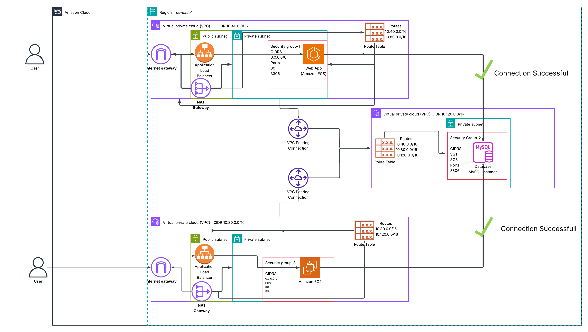

# Evidence Pack

## Project

Secure Multi-Tier AWS Application Platform with Private Database Connectivity

## Purpose

This evidence pack documents the deployed AWS architecture, validation results, troubleshooting process, and final working state of the project.

The goal is to prove that the infrastructure was not only written in Terraform, but actually deployed, tested, debugged, and validated across networking, compute, load balancing, database connectivity, and application behavior.

---

## 1. Architecture Evidence

### Architecture Diagram



### Architecture Flow

```text
User
  ↓
Application Load Balancer
  ↓
Private Application Workload
  ├── ECS on EC2 Dockerized Flask App
  └── Standalone EC2 Flask App
  ↓
VPC Peering
  ↓
Private RDS MySQL Database